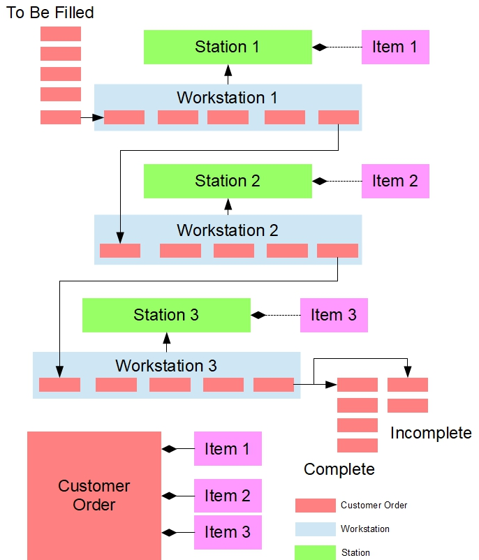

# Assembly Line Simulation Project


## Overview
This project is a **C++ Assembly Line Simulation** built using **Object-Oriented Programming (OOP)** principles. It models an assembly line with multiple stations processing customer orders for various products.  




The simulation consists of **workstations** that hold specific stock items and a **Line Manager** that moves customer orders along the line. Each order contains a list of items to be filled. Stations fill orders if they have the item in stock, and orders progress until completion or remain incomplete due to insufficient inventory.

### Key Goals
- Simulate and analyze the functioning of an assembly line.
- Understand station processes and interactions.
- Identify bottlenecks and optimize workflow.
- Manage customer orders efficiently and track completion status.

---

## Milestones

### Milestone 1: Utilities and Station
- Implemented the `Utilities` class to parse input files and tokenize strings.
- Implemented the `Station` class to manage items and process customer orders.

### Milestone 2: CustomerOrder and Workstation
- Introduced the `CustomerOrder` class to manage orders and their items.
- Implemented the `Workstation` class to fill orders and move them along the line.

### Milestone 3: LineManager
- Implemented the `LineManager` class to configure the assembly line.
- Managed the flow of orders through stations and determined completed or incomplete orders.
- Simulated step-by-step processing and station interactions.

---

## Features
- Object-Oriented design with multiple interacting classes.
- Dynamic memory allocation for handling orders efficiently.
- Realistic modeling of order movement and item filling.
- Tracking of completed and incomplete customer orders.
- Modular design for easy extension and testing.

---

## How to Run
Clone the repository:
```bash
git clone https://github.com/your-username/Assembly-Line-Simulation.git
```

## Contributors

- **Professor Cornel Barna** (Instructor, Seneca Polytechnic, OOP345, 2023 Winter)  
- **Di Liu** - [dliu84](https://github.com/dliu84)  

## Citation

If you use this project in your work, please cite it as follows:

> Di Liu (2025). *Assembly-Line-Simulation*. GitHub. [https://github.com/dliu84/Assembly-Line-Simulation](https://github.com/dliu84/Assembly-Line-Simulation)

